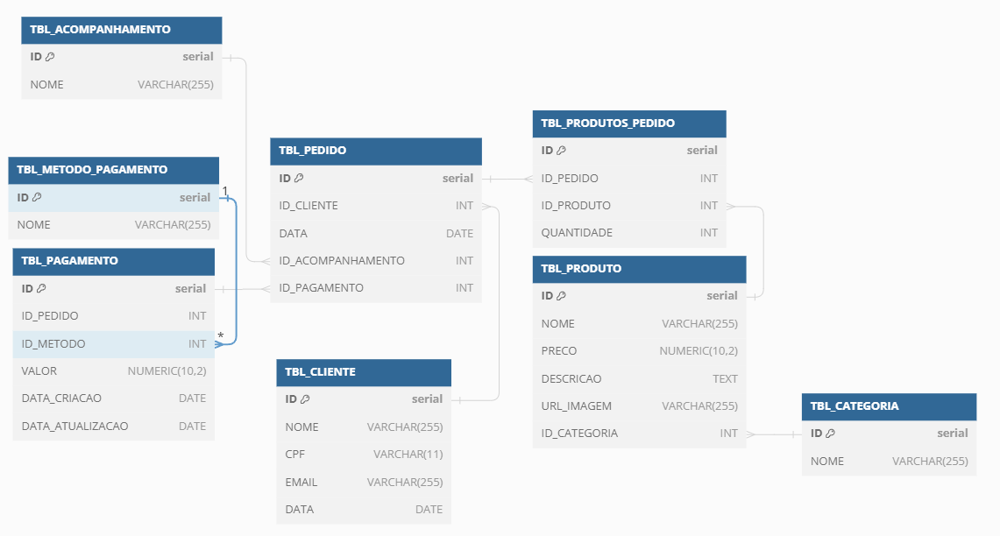

# Justificativa para a Escolha do Banco de Dados

Inicialmente, nosso projeto foi arquitetado como uma solução monolítica, onde a coerência e a integridade dos dados, juntamente com uma gestão eficiente das relações entre tabelas, eram aspectos fundamentais. Com base nessas necessidades primordiais, a escolha recaiu sobre o **PostgreSQL**. Esta decisão foi influenciada pela familiaridade prévia da nossa equipe com essa tecnologia, permitindo-nos aproveitar ao máximo suas capacidades desde o início do projeto.

À medida que o projeto evoluiu, emergiu a necessidade de isolamento do processo de autenticação em um microsserviço dedicado. Esta evolução sinalizou o início de uma transição gradual de nossa arquitetura monolítica para um ecossistema baseado em microsserviços. Nesse contexto, acreditamos que manter uma abordagem pragmática é crucial, optando por migrar nosso banco de dados PostgreSQL já estabelecido para um serviço gerenciado na nuvem. Especificamente, escolhemos o **AWS RDS** como nossa plataforma de destino, considerando várias vantagens estratégicas.

## Critérios de Decisão

A decisão de adotar o AWS RDS foi guiada por múltiplos fatores:

- **Compatibilidade:** Desejávamos evitar alterações significativas no código existente durante a migração para a nuvem, focando em preservar a estabilidade e a confiabilidade do sistema.
- **Simplificação da Gestão de Infraestrutura:** Ao escolher uma solução de banco de dados como serviço (DBaaS) que suporta nativamente o PostgreSQL, asseguramos uma transição suave, minimizando a necessidade de ajustes técnicos substanciais.

## Visão Futura

Olhando para o futuro, à medida que prosseguimos com a fragmentação do monólito em serviços mais granulares, reconhecemos a importância de uma reavaliação contínua da nossa estratégia de dados. Este processo será crucial para determinar a adequação das soluções de banco de dados para as necessidades individuais de cada microsserviço. Estamos comprometidos em adotar uma abordagem adaptativa, garantindo que nossa infraestrutura de dados permaneça alinhada com os princípios de eficiência, escalabilidade e desacoplamento.

Em resumo, a migração para o AWS RDS não é apenas uma medida prática no contexto imediato, mas também um passo estratégico rumo a uma maior flexibilidade e robustez na gestão de dados. Isso reflete nosso compromisso em evoluir nossa infraestrutura tecnológica de maneira que suporte de forma eficaz a expansão e a diversificação do nosso projeto, preparando o terreno para inovações futuras.

## Documentação da modelagem de dados
