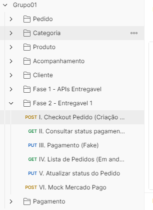

# Tech Challenge - Pós-Tech SOAT - FIAP - Grupo 01

Este é o projeto desenvolvido durante a fase I do curso de pós-graduação em arquitetura de software da FIAP - 3SOAT


## Membros:
- [Camila Lemos de Melo - RM 352359]()
- [Christian Soares Santos - RM 351509](https://www.linkedin.com/in/christian-soares-93250a170/)
- [Fábio Guimarães Martins - RM 351825](https://www.linkedin.com/in/fabio-martins-2021)
- [Josué Batista Cruz Júnior - RM 352045](https://www.linkedin.com/in/josuejuniorjf/)

## Entregáveis da  Fase 1
Para acessar a documentação e os entregaveis da Fase 01 acesse a branch [fase-1](https://github.com/camilaldmelo/PosTechFiap/tree/fase-1).

## Entregáveis da Fase 2

### Entregável 01
Realizamos uma refatoração significativa do projeto desenvolvido na Fase 01, integrando os princípios da arquitetura hexagonal e os conceitos fundamentais da Clean Architecture. A refatoração se concentrou em estruturar o aplicativo em camadas concêntricas, cada uma com suas responsabilidades específicas e operando de maneira independente. No núcleo do projeto, posicionamos as regras de negócio, abrangendo Entidades e Casos de Uso. Essa parte central é circundada pela camada de aplicação, seguida pelos adaptadores de interface e, finalmente, pela camada de infraestrutura e frameworks.


A adoção desse modelo arquitetônico visa otimizar a manutenção e a escalabilidade do software. Graças a essa estrutura, mudanças tecnológicas e atualizações de framework podem ser implementadas com mínimo impacto sobre as regras de negócio centrais. Além disso, essa abordagem aprimora significativamente a testabilidade do aplicativo e oferece uma flexibilidade maior na arquitetura do software, garantindo assim um desenvolvimento mais ágil e adaptável a mudanças futuras.

#### a. Alterar/criar as APIs:

##### i. Checkout Pedido que deverá recever os produtos solicitados e retornar a identificação do pedido.

 ```bash
POST http://localhost:8080/Pedido

{
  "produtosPedido": [
    {
      "idProduto": 1,
      "quantidade": 1
    },
    {
      "idProduto": 3,
      "quantidade": 4
    }
  ]
}
```

##### ii. Consultar status de pagamento do pedido, que informa se o pagamento foi aprovado ou não.

 ```bash
GET http://localhost:8080/Pagamento/6
```

##### iii. Webhook para receber a confirmação de pagamento aprovado ou recusado.
 ```bash
POST http://localhost:8080/Pagamento

{
  "idPedido": 6,
  "aprovado": true,
  "motivo": "Pagamento aprovado."
}
```
 ##### iv. Listagem de pedidos.
 ```bash
GET http://localhost:8080/Pedido/InProgress
```
##### v. Atualizar o status do Pedido.
 ```bash
PUT http://localhost:8080/Pedido/PedidoStatus?idPedido=6&idStatus=3
```
##### vi.Desafio extra - integração com o Mercado Pago.
Não implementamos o desafio extra, referente a integração com o Mercado Pago.
Porém criamos uma rota no nosso endpoint para simular o mock, que seria a chamada ao Mercado Pago para geração e pagamento via QRCode
 
 ```bash
PUT http://localhost:8080/Pagamento/6
```
Nessa etapa, apos a identificação do pagamento do QRCode, é chamado o WebHook disponibilizado no passo III, retornando o callback que o pagamento foi aprovado.


### Entregável 02 - Arquitetura em Kubernetes
Este guia fornecerá instruções passo a passo sobre como clonar e executar a aplicação .NET 7.0 com um banco de dados PostgreSQL usando a arquitetura em Kubernetes. Certifique-se de ter no seu ambiente o Kubernetes instalado e configurado, se for rodar localmente, ou siga as instruções da sua cloud.

- [Estrutura e Funcionamento do Banco de Dados no Kubernetes](https://github.com/camilaldmelo/PosTechFiap/tree/fase-2/Kubernetes/db/README.md)
- [Estrutura e Funcionamento da API no Kubernetes](https://github.com/camilaldmelo/PosTechFiap/tree/fase-2/Kubernetes/api/README.md)

#### Passo 1: Clone o Repositório 
Para começar, você precisa clonar o repositório do GitHub, para ter acesso aos arguivos. Abra o terminal e execute o seguinte comando:

```bash
git clone https://github.com/camilaldmelo/PosTechFiap.git
```

#### Passo 2: Navegue até o Diretório onde estão os arquivos do Kubernetes
Após clonar o repositório, navegue até o diretório do projeto usando o seguinte comando:
```bash
cd PosTechFiap/Kubernetes
```

#### Passo 3: Navegue até o Diretório do db
Navegue até o diretório da api usando os seguintes comandos:
```bash
cd ..
cd db
```

#### Passo 4: Execute os comandos na ordem:
Execute usando os seguintes comandos:
```bash
kubectl apply -f "1 - postgres-secret.yml"
kubectl apply -f "2 - init-sql-script-configmap.yml"
kubectl apply -f "3 - postgres-pvc.yml"
kubectl apply -f "4 - postgres-statefulset.yml"
kubectl apply -f "5 - postgres-service.yml"
kubectl apply -f "6 - postgres-init-job.yml"
```

#### Passo 5: Navegue até o Diretório da api
Navegue até o diretório da api usando o seguinte comando:
```bash
cd api
```

#### Passo 6: Execute os comandos na ordem:
Execute usando os seguintes comandos:
```bash
kubectl apply -f "1 - api-deployment.yml"
kubectl apply -f "2 - api-service.yml"
kubectl apply -f "3 - api-hpa.yml"
```

#### Passo 7: Exclusão da arquitetura em Kubernetes (Opcional)
Execute os comando dentro de cada diretório.
No diretório Kubernetes/api:
```bash
kubectl delete -f "3 - api-hpa.yml"
kubectl delete -f "2 - api-service.yml"
kubectl delete -f "1 - api-deployment.yml"
```
No diretório Kubertenes/db:
```bash
kubectl delete -f "6 - postgres-init-job.yml"
kubectl delete -f "5 - postgres-service.yml"
kubectl delete -f "4 - postgres-statefulset.yml"
kubectl delete pvc -l app=postgres  
kubectl delete -f "2 - init-sql-script-configmap.yml"
kubectl delete -f "1 - postgres-secret.yml"
```
Ou pode ser executado o comando abaix para deletar todas as infraestrutura que esta rodando no K8s:
```bash
kubectl delete all --all
```

### Entregável 03

#### a. Desenho da arquitetura


#### b. Collection do Postman
[Baixe o Postman Collection](docs/Grupo01.postman_collection.json)

#### c. Instruções para execução do projeto
Para inicialização em ambiente local, como Docker Desktop, após a inicialização bem-sucedida da infraestrutura do Kubernetes, você pode acessar a aplicação em seu navegador ou usando ferramentas como o curl. A API estará disponível na porta 8080.

- Acesse a API em http://localhost:8080/swagger ou http://localhost:8080/api-docs

Utilizar a Collection do Postman, que possui todas as rotas possiveis com exemplos. Na Collection, também está separado as rotas separados por entregáveis.


#### d. Video demostrando a arquitetura 